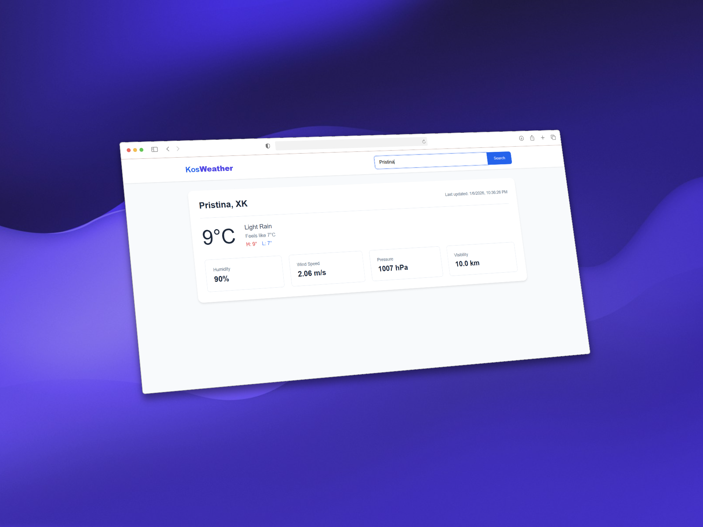
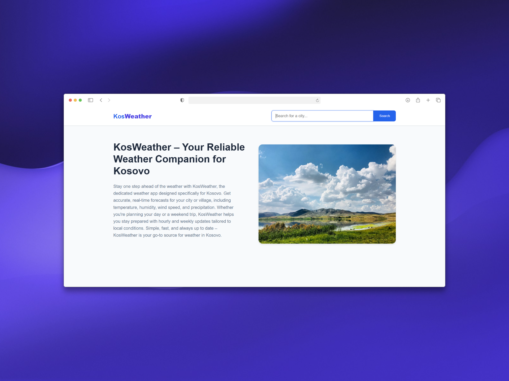
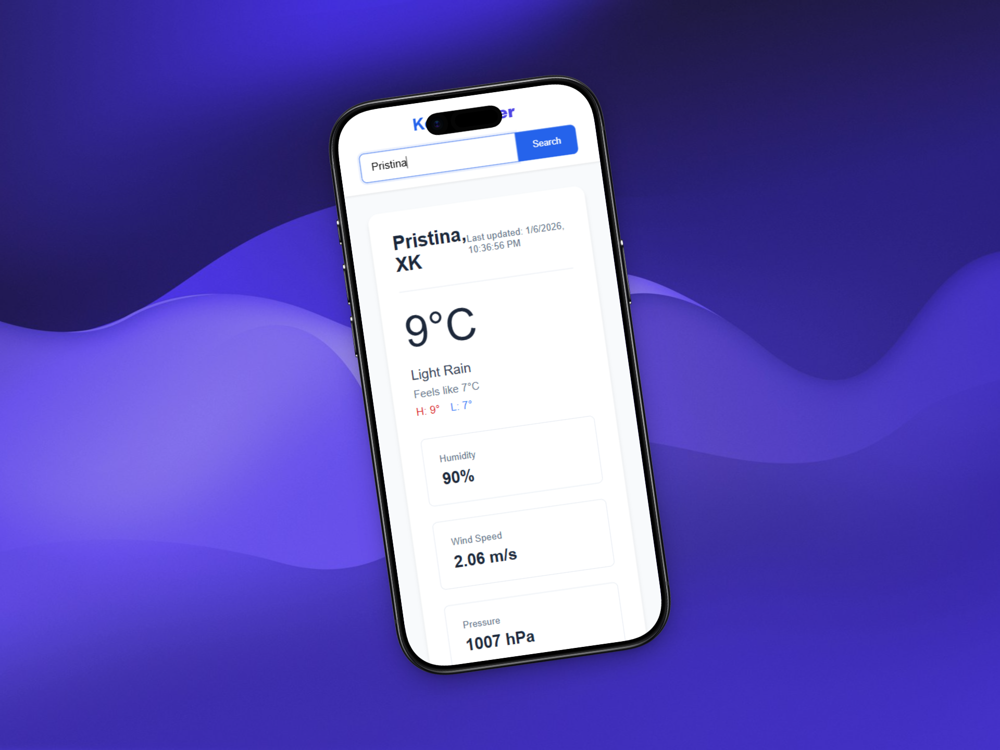
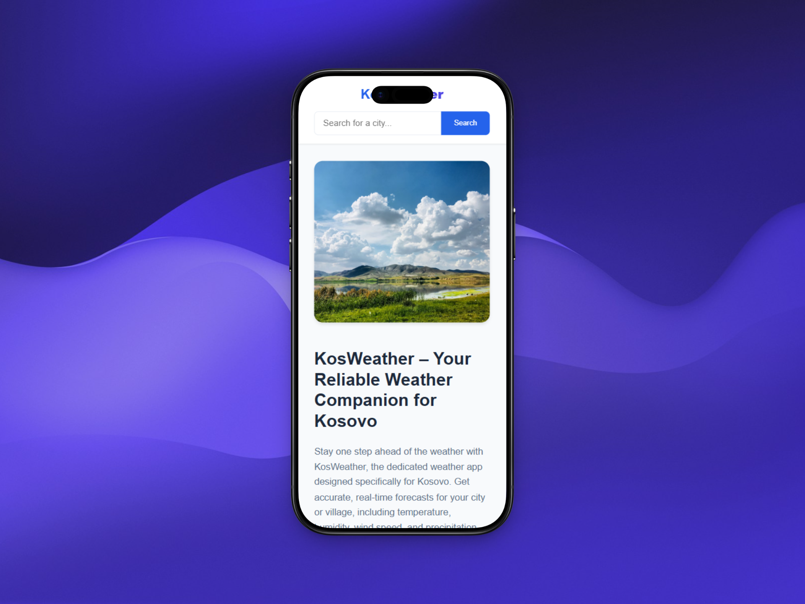

# KosWeather – Weather Application

A modern weather application built with HTML, CSS, and JavaScript that consumes a weather API to display real-time, location-based weather data with a clean and responsive UI.
 
The site is live at https://erionsfarqa.github.io/Weather-Dashboard/
## Project Screenshots

  
Desktop views of the website

  
  
   
  
Mobile views of the website

    
  

